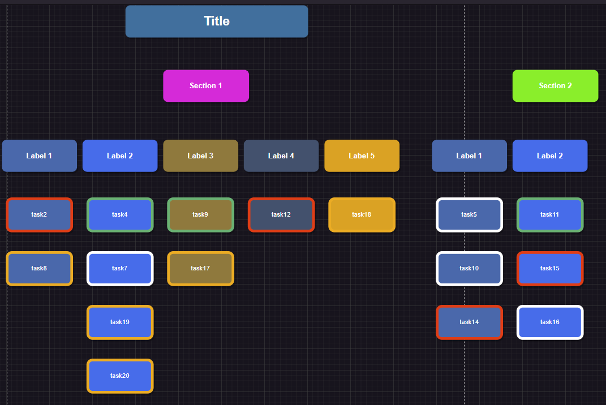
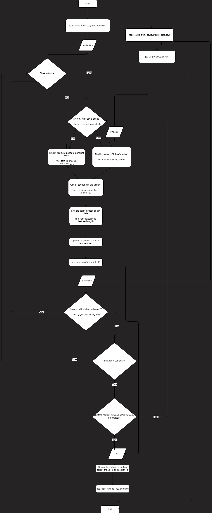

# Todoist Task Adding Project

This project provides a Python script for adding tasks to your [Todoist](https://todoist.com) account. Functions for adding tasks from csv file are located in the todoist.py file. See documentation of the file in [Todoist adding functions](#todoist-adding-functions) section.

Additionally, the script can be used to create a [Work Breakdown Structure](https://en.wikipedia.org/wiki/Work_breakdown_structure) (WBS) chart from active tasks on your Todoist account. For that purpose, the script uses the [draw.io](https://www.drawio.com/). Draw.io is a free online diagram software for making flowcharts, process diagrams, org charts, UML, ER and network diagrams. Created with draw.io, the WBS chart can be exported as a PNG file and it can be modified further in a draw.io. 

In chart is marked the sections, labels that I use to mark courses, and below courses are the tasks. Tasks have a priority, which is marked with different colors. 



## ## Features

- Fetch active tasks, projects, and sections from Todoist.
- Visualize tasks in an XML chart with customizable styling.

## Prerequisites

- A [Todoist](https://todoist.com) account.
- An API token from Todoist. Read more about Todoist API documentation [here](https://developer.todoist.com/rest/v2#overview).

## Getting Started

To use this script, you need to change the values in muuttujat.txt to your own.

1. Add your Todoist API token to the muuttujat.txt file.

2. Rename muuttujat.txt to muuttujat.py. This changes the file into a Python module that can be used in the script.

## Activate the virtual environment

Activate the virtual environment with a nested shell provided by Poetry:

```powershell
poetry shell
```

To deactivate the virtual environment, type:

```powershell
exit
```

## Todoist adding functions

| Function Name            | Description                                         | Parameters                                                    | Returns                                        |
|--------------------------|-----------------------------------------------------|---------------------------------------------------------------|------------------------------------------------|
| `get_all_projects`       | Retrieves all projects from Todoist.                | `api_key` (str): API key for authentication.                  | List of Project objects.                       |
| `get_one_project`        | Retrieves a specific project by its ID.             | `api_key` (str): API key.<br>`project_id` (int): ID of the project. | Project object or `None` if an error occurs.   |
| `get_all_sections`       | Retrieves all sections in a project.                | `api_key` (str): API key.<br>`project_id` (int): ID of the project. | List of Section objects or `None`.             |
| `add_new_task`           | Adds a new task to Todoist.                         | `api_key` (str): API key.<br>`task` (Task): Object containing task details. | Added Task object or `None`.                   |
| `find_item_id`           | Finds an item (e.g., project or section) by name and returns its ID. | `items` (list): List of items to search through.<br>`item_name` (str): Name of the item to find. | Item ID or `None` if not found.                |
| `read_tasks_from_csv`    | Reads tasks from a CSV file and returns a list of Task objects. | `file_path` (str): Path to the CSV file.                     | List of Task objects.                          |
| `check_if_str`           | Checks if the given `task_id` is a string.          | `task_id` (any): The `task_id` to check.                      | `True` if `task_id` is a string, otherwise `False`. |




## Chart making functions

| Function Name          | Description                                         | Parameters                                                                                                              | Returns                                             |
|------------------------|-----------------------------------------------------|-------------------------------------------------------------------------------------------------------------------------|-----------------------------------------------------|
| `get_all_active_tasks` | Retrieves all active tasks using the provided API key. | `api_key` (str): API key for authentication.                                                       | A list of active tasks or `None` if an error occurs. |
| `get_all_sections`     | Gets all sections in a project.                       | `api_key` (str): API key for authentication.<br>`project_id` (int): The ID of the project.                   | A list of Section items or `None`.                   |
| `get_all_projects`     | Gets all projects.                                    | `api_key` (str): API key for authentication.                                                                 | A list of Project items or `None` if an error occurs.|
| `find_item_id`         | Finds an item (e.g., project or section) by name and returns its ID. | `items` (list): A list of items to search through.<br>`item_name` (str): The name of the item to find. | The ID of the found item, or `None` if not found.    |
| `find_item_name`       | Finds an item (e.g., project or section) by ID and returns its name. | `items` (list): A list of items to search through.<br>`item_id` (int): The ID of the item to find.     | The name of the found item, or `None` if not found.  |
| `add_task_to_xml`      | Adds a task to an XML file.                           | `item_object` (Chart): An object containing the task details, including task ID, content, coordinates, and style info.| None                                                |


## Dependences:

- Python
- [Poetry](https://python-poetry.org/docs/)